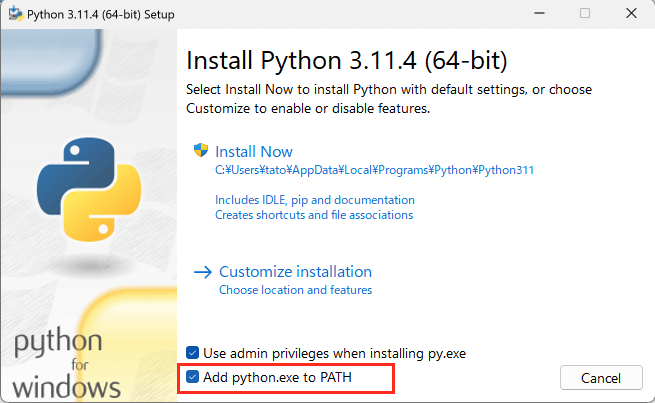
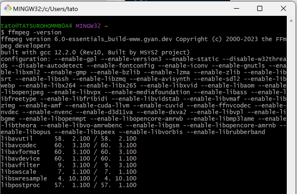
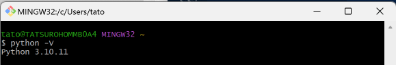
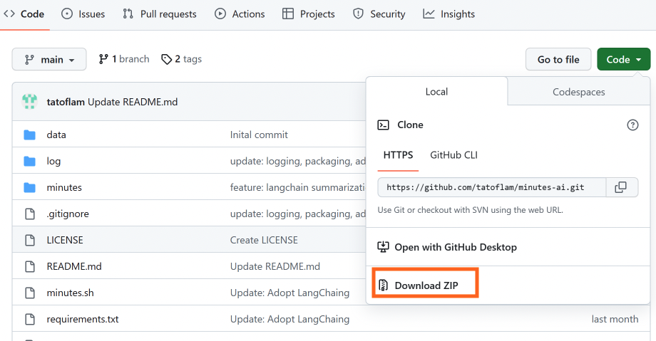

## Windowsインストール手順

- 20230615時点のメモです
- 64bit版 Windows　に、githubから.zipファイルをダウンロードして使うことが前提

### 必要なソフトのインストール

#### ffmpeg

音声・動画ファイルを変換・分割するために使います。  

- 参考: [【初心者】FFmpegのダウンロードとインストール手順～Windows/Mac/Linux](https://jp.videoproc.com/edit-convert/how-to-download-and-install-ffmpeg.htm)

- [公式サイト](https://ffmpeg.org/download.html)からWindows版をインストール
  - `Windows EXE Files` > `Windows builds by BtbN`
  - リンク先から `ffmpeg-master-latest-win64-gpl-shared.zip`をダウンロード
- ダウンロードしたzipファイルを任意の場所に展開する
- 展開したフォルダ"******" > "bin" フォルダのパスをコピーする
- コピーしたパスを、環境変数 (ユーザー環境変数) に追加する

#### Python

プログラムの実行のために必要です。

- [公式サイト](https://www.python.org/downloads/windows/)からWindows版インストーラーをダウンロード
  - Download Windows installer (64-bit)
- `python-3.xx.x-xxxxx.exe`を起動。最初のページで、`Add python.exe to PATH` にチェックを入れて、ウィザードにしたがってインストール。基本、全部「Next」でOK。



#### Git for Windows

Git bashを使って、Bashコマンドを実行するために使います。Gitはソースコード管理のためのツールですが、今回はGit bashのダウンロードが目的です。

- [公式サイト](https://gitforwindows.org/)からダウンロード
- ウィザードに従ってダウンロード。`Git Bash`が含まれていたらOK。基本、全て、Recommendに従って「Next」でOK。

### インストールしたソフトの確認

インストールが完了したら、Windowsメニューから`Git Bash`を選択するか検索して開き、Git bash上で`ffmpeg`、`python`を実行できることを確認する

#### ffmpeg

Git Bashで以下を実行

```
ffmpeg -version
```

以下のような結果が表示される(バージョンは異なります)




#### Python

Git Bashで以下を実行

```
python -V
```

以下のような結果が表示される(バージョンは異なります)



### ツールのダウンロード

- [minutes-aiのgithubのメインページ](../)から、`Code`>`Download ZIP`で、zipファイルをダウンロード

- 任意の場所にzipファイルを配置し、展開


### Python実行環境の準備

この後の手順は、メインページと重複していますが、Windows向けにちょっと詳しめに書いてあります。

#### Python 仮想環境を作成する

他のツールと競合して思わぬ動作にならないように、Python仮想環境上で実行します。  

- Git Bashを起動する
- Git Bashで、`cd`でツールのディレクトリに移動。たとえば..
  ```
  $ cd /c/Users/tato/Downloads/minutes-ai-main/minutes-ai-main
  ```

- 自分が今、どこにいるかを確認するのは、`pwd`コマンド。
  ```
  $ pwd
  /c/Users/tato/Downloads/minutes-ai-main/minutes-ai-main
  ```

- 今のディレクトリの配下にあるファイルを確認するのは、`ls`コマンド
  ```
  $ ls
  LICENSE    data/  log/      minutes.sh*       
  setup.py README.md   minutes/  requirements.txt
  ```

- 上の各ファイルが確認できる場所まで移動したら、以下のコマンドでpythonの仮想環境を作成 (`env`という名前の仮想環境を作る)
  ```
  $ python -m venv env
  ```

- 仮想環境に入る

  ```
  $ source env/Scripts/activate
  (env)
  ```

#### 必要なライブラリをインストールする

- 仮想環境に入った状態で `pip`を使って、pythonのライブラリをインストールします
  ```
  $ pip install -r requirements.txt
  ```

- インストールが終わったら、仮想環境から抜ける
  ```
  $ deactivate
  ```

これでインストールは完了です。
